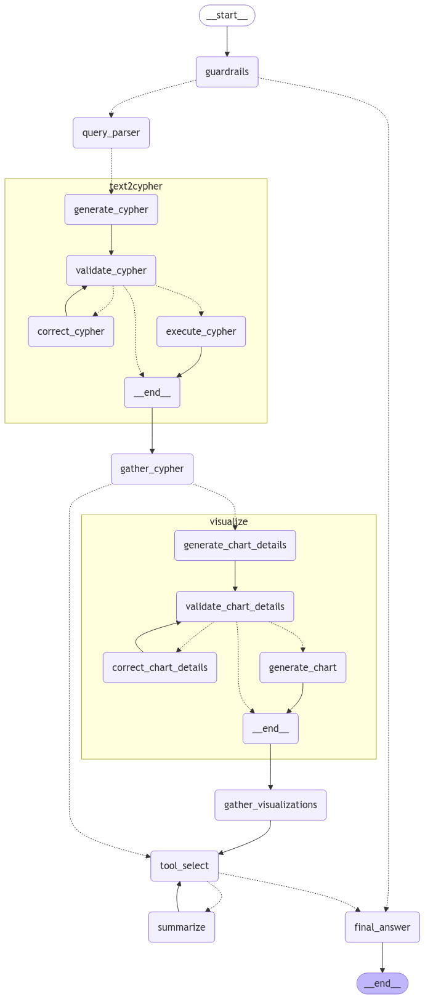

# ps-genai-agents
The goal of this project is to provide generalized agent workflows that can be applied to many graph use cases. The agents and workflows are built using LangGraph and contain components using both LangChain and the Neo4j GraphRAG library.

## Single Agent Workflows
These are agentic workflows that contain a single agent. They are simple and may easily be integrated into more complex multi-agent workflows.

Single agent workflows may be found in `ps_genai_agents.workflows.single_agent`

### Text2Cypher
An agentic workflow that generates Cypher, validates and corrects if necessary, then executes against the Neo4j database.

### Data Visualization
An agentic workflow that generates chart configuration based on provided data, validates and corrects the configuration if necessary, then generates a chart.

## Multi-Agent Workflows
These workflows are comprised of multiple agents and contain mroe advanced features than the single agent workflows above.

Multi-agent workflows may be found in `ps_genai_agents.workflows.multi_agent`

### Advanced Text2Cypher
An agentic workflow that extends the functionality of the single agent Text2Cypher workflow with scope validation, query parsing and summarization.

### Advanced Text2Cypher with Data Visualization
An agentic workflow that extends the functionality of the advanced Text2Cypher workflow with chart generation. This workflow is demonstrated in the `demo_notebook.ipynb` and `demo_notebook_non_llm_val.ipynb` notebooks.

`demo_notebook_non_llm_val.ipynb` contains Text2Cypher validation without the use of an LLM.

The architecture of the workflow is shown below.

## Custom Workflows
Custom workflows may be created with this package. All nodes used in the above workflows are found in `ps_genai_agents.components`. They are built to function with predefined states found in `ps_genai_agents.components.state`.

## Set Up Project

1. Clone or Fork the project to your local machine

2. Install Poetry for dependency management

3. Run `make init`

This will install:
* All dependencies required for local development
* Pre-commit hooks for formatting, linting, Python type validation

4. Run `make test_unit` to test install was successful

## Testing
To run integration tests locally Docker must be installed and running. This will allow the Neo4j test instance to be deployed.

`make test_local` : Run all unit and integration tests

`make test_unit` : Run all unit tests

`make test_integration_local` : Run all integration tests
